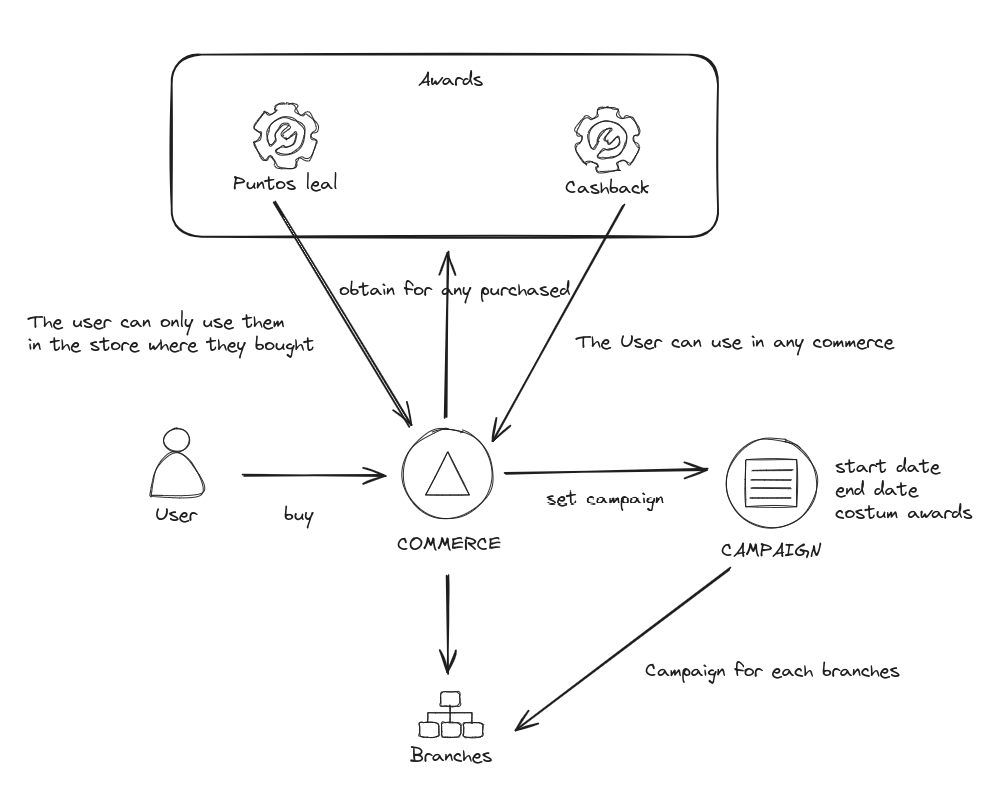
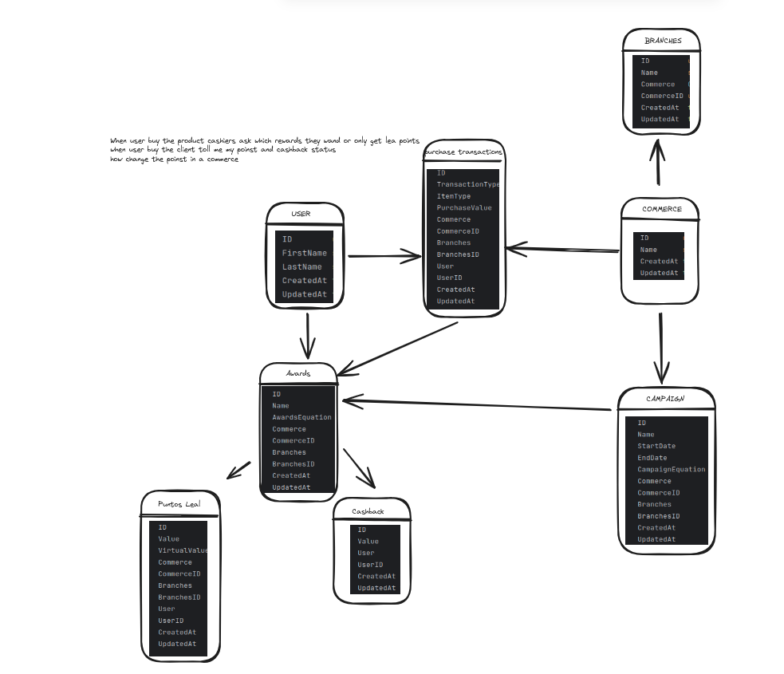
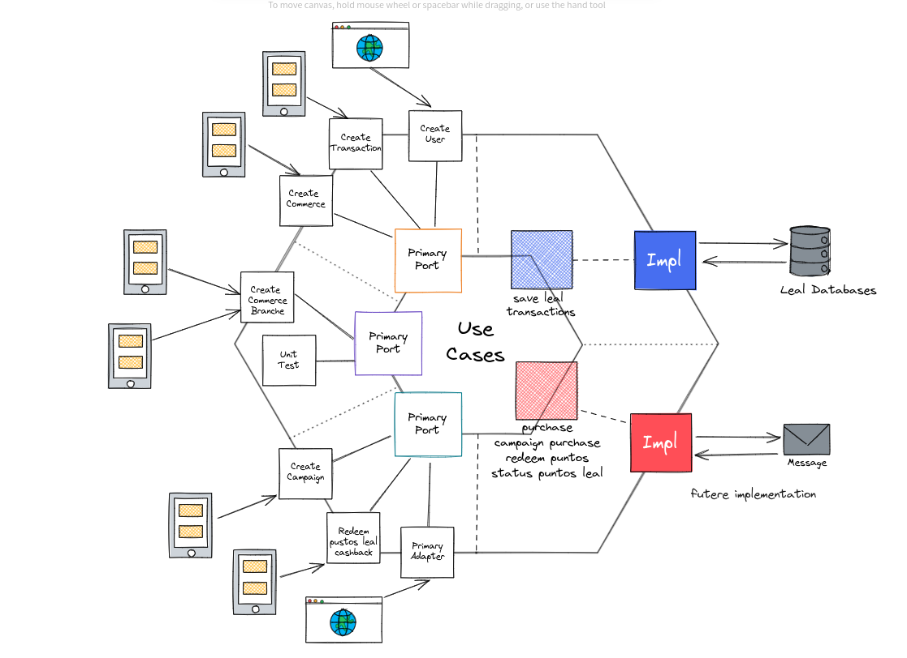

# Demonstration-leal-test

This proyect is a test interview 

## Arquitecture and models

### user model

### domain model

### hexagoanl model


## Run local proyect command with docker 

1. run th next commands
```shell
 docker-compose up --build
```

## Test
```shell
go test ./..
```

## documentation api

http://localhost:5000/v1/docs/index.html

## coverage platform 

https://app.codecov.io/gh/crevelandiagu/demonstration-leal-test


https://sonarcloud.io/project/overview?id=crevelandiagu_demonstration-leal-test